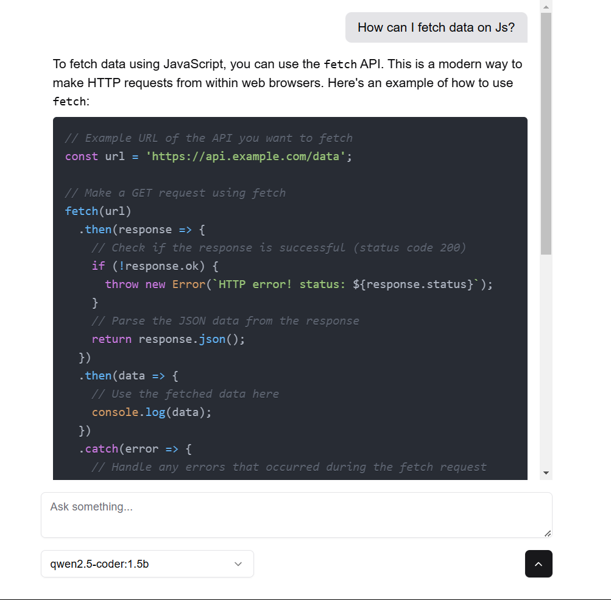
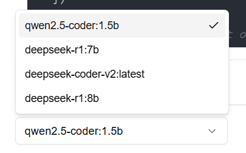

AI Chat using ollama API with local models




## Requirements

- [Ollama]('https://ollama.com/')
- Any local ai model installed via ollama

## Installation

Install dependencies:
```bash
npm install
# or
yarn install
# or
pnpm install
# or
bun install
```

Run the server:
``` bash
npm run dev
# or
yarn dev
# or
pnpm dev
# or
bun dev	   
```
